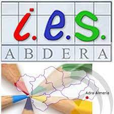

# Taller 2: Introdución a Markdown
### Asignatura: Despliegue de aplicaciones web

`Markdown` será perfecto para ti sobre todo si **publicas** de manera constante en Internet, donde el *lenguaje HTML* está más que presente: 
- WordPress
- Squarespace
- Jekyll

Pero no estoy hablando solo de blogs o páginas web. Servicios como _Trello_ o foros como _Stackoverflow_ también soportan este lenguaje, y con el paso del tiempo encontrarás aún más lugares que lo utilicen.

Por qué  utilizar __Markdown__:
1. Compatible con todas las plataformas
2. Contenido siempre accesible desde cualquier dispositivo

Para saber más sobre [Markdown](https://markdown.es) visita el enlace.

[Enlace a la prueba](prueba.txt)

| Alumna | Curso | Profesor |
| --- | --- | --- |
| Inés Pernil Romero | 2ºDAW | Francisco |

